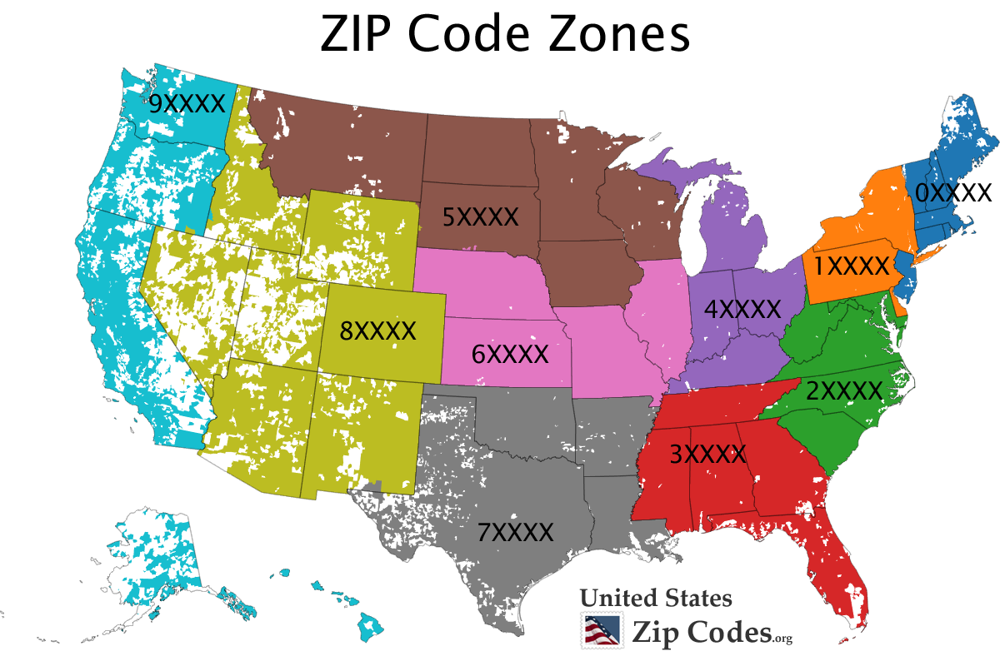
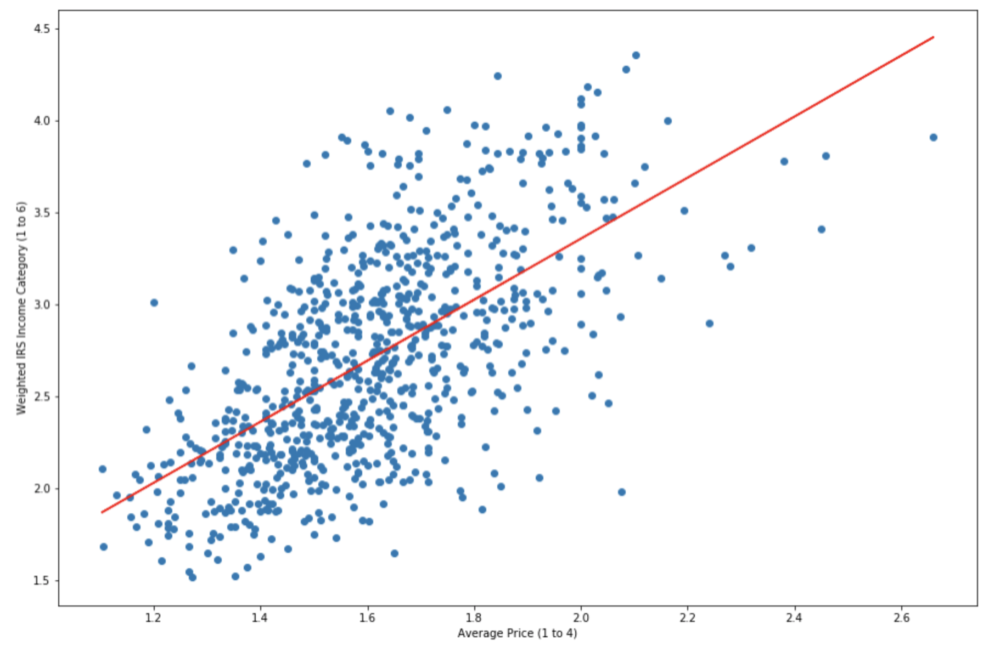
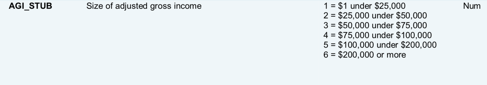
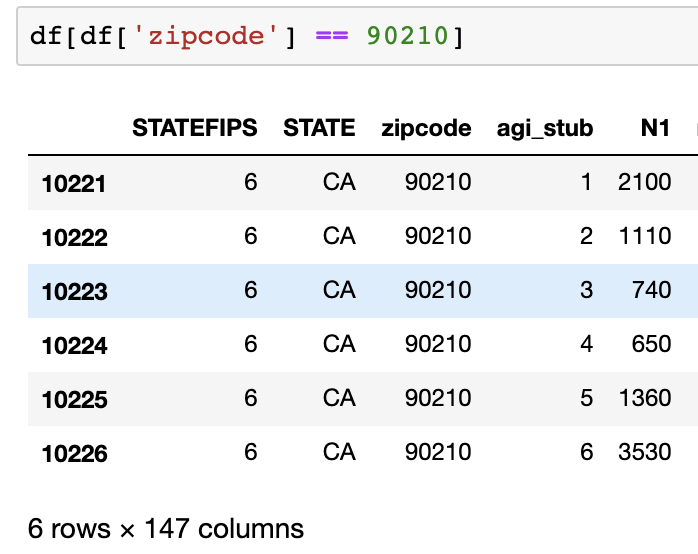
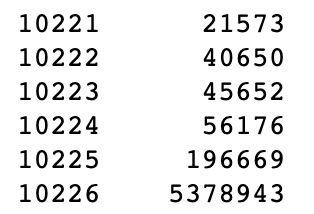
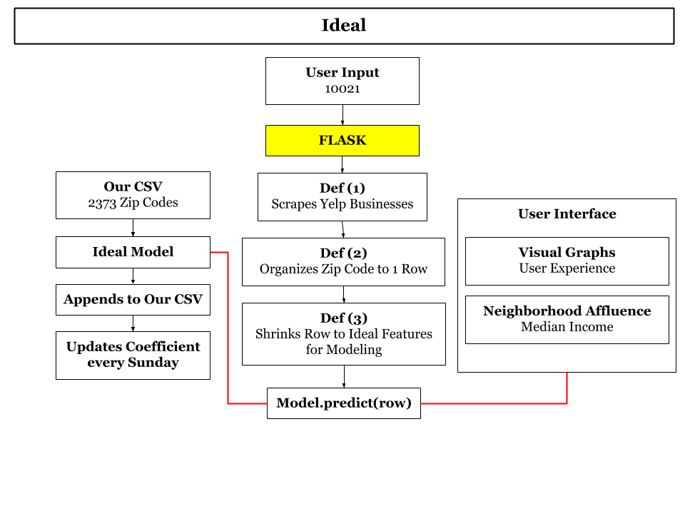
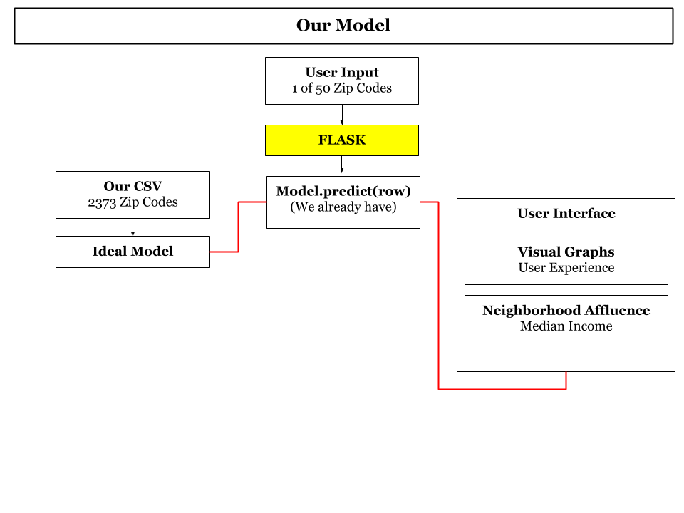

**Authors: Erin Hwang, Mario Sanchez, Jawaid Ismail**

Slides: https://docs.google.com/presentation/d/1Msfho9gCtnPJdV0CNpGb_Ku8gZpvU9OtiosOreGeqBU/edit#slide=id.g5e63e56fff_0_11

# Utilizing Yelp Cost Estimates for Estimating Neighborhood Affluency

**Problem Statement**: This tool will estimate the affluence of a neighborhood based on the number of $ of businesses and services (according to Yelp) in a given neighborhood. ($, $$, $$$) This tool will expect to get, as an input, a list of zip codes or names of neighborhoods and will estimate the wealth of the locality. While traditional methods typically estimate wealth of a locality based on demographic characteristics (e.g. income or unemployment rate), the novelty of this approach is in its use of big data related to commercial activity and cost of product and services as an indicator for affluency.

**Folders**:
- `06_selenium_target_variable`
- `datasets`
- `flask_app_FINAL`
- `playground`
- `visuals`

**Notebooks**:
- `01_Yelp_Scrape_final.ipynb`
- `02_CleaningAndConsolidatingWestCoast.ipynb`
- `03_Categories.ipynb`
- `04_CheckingMother.ipynb`
- `05_ReasonsWhyIRSDataIsBad.ipynb`
- `07_CompilingScrapedIncome.ipynb`
- `08_CreatingGrandma.ipynb`
- `09_ModelingPhase1-Model_to_EDA.ipynb`
- `10_ModelingPhase1-Model_to_EDA_SCALED_PCA.ipynb`
- `11_TheCreationOfDemos.ipynb`
- `IRS.ipynb`
- `MapPoints.ipynb`

**Other Files**:
- `model_gb_mother.pkl`

---
# Executive Summary

New Light Technologies asked us to create a model that predicts neighborhood affluence using Yelp data. Our first question: what best determines affluence? Is it the average price of residential property? Or is it the median income? For this project, our target variable (prediction of neighborhood affluence) will be the median income based on the zip code. By web scraping Yelp businesses, we found the following features that might be helpful when predicting neighborhood affluence. 

- Price level ($, $$, $$$, $$$$)
- Category Names (i.e. Thai, Wine-Bars, Hookah)
- City
- Average Rating
- Latitude
- Longitude 

Can this data be used to estimate the affluence of a neighborhood, or at least be an added indicator to what is already available? For this project, we will scrape majority of the businesses in the west coast (or at least states where zip codes start with 9). Our scraped data will target the following states:

- California 
- Oregon 
- Washington
- Alaska
- Hawaii 

Finally, we will launch our project on Flask. This is the beta version of our app when predicting neighborhood affluence. 

---

# Repository Walkthrough 

This portion of the README will walkthough our workflow of the project in chronological order. Please follow along!

Our first objective is to scrape our key features and neighborhood affluence. We first got 2016 data from IRS on tax returns. By identifying how the IRS data is organized, we decided to not use the IRS data as neighborhood affluence. Notebook `05_ReasonsWhyIRSDataIsBad.ipynb` has reasons and justifications why the IRS dataset on tax returns is not the greatest predictor of affluency. **Note: We will talk about this later in the walkthrough**. Fortunately, the IRS data helped us obtain all the zip codes starting with 9 (which was very convenient for us). In `01_Yelp_Scrape_final.ipynb`, we successfully scraped Yelp businesses using the API key Yelp has given us. Using the list of zip codes from IRS data, we scraped approximately 85,000 unique businesses from 5 states (California, Oregon, Washington, Alaska, and Hawaii). Finally, organized the data into a pandas dataframe. 

After scraping businesses, we had a lot of data cleaning to do. In `02_CleaningAndConsolidatingWestCoast.ipynb`, we executed the following data cleaning tasks: 
- Kept all zip codes that started with 9 (somehow Yelp obtained zip codes from Guam, Tijuan, and the UK).
- Remove rows where price category is NaN (since imputing the value will create a bias).
- Imputed longitude and latitude (since only 5 rows were missing). 
- Replaced all NaNs in category columns with `?`
- Appended a column with count of businesses

**Remember**: At this point, we cleaned our data and each row in our dataframe represent a business. Our next objective is to group the dataframe by zip code (since our group considers the term neighborhood as a zip code).

We're are still `02_CleaningAndConsolidatingWestCoast.ipynb`.  The following steps were executed to group the dataframe by zip code. 
- Grouped by zip code using `.pivot` (we kept count, latitude, and longitude)
- Appended a column that specifies the city the zip code is located
- Appended columns based on the count of businesses based on the specific price level and ratings. At this point we summarized the data where each row represents zip code
- For example zip code 90004 has the following information: 
    - Total of 29 businesses
    - 10 cheap businesses ($)
    - 19 average priced businesses ($$)
    - 1 business where the average rating is 3.5
    - 19 businesses where the average rating is 4
    - 6 businesses where the average rating is 4.5
    - 3 businesses where average rating is 5
    - **Note: Total Number of Businesses based on price = Total Number of Businesses based on Average Rating = Total Count of Businesses for that particular zip code.**
    
Now we're in `03_Categories.ipynb`. In this notebook, we read in the dataframe with all unique businesses and their appropriate categories. In order to group the categories based on zip code, we executed the following:
- Grouped by zip code and find all unique categories per zip code
- Found all unique categories of all businesses we scraped (total of 468 categories)
- Created a binary dataframe 
    - For example, if businesses in zip code 90004 has a business with category `sandwich`, 1 is added to the 90004 row. 
    - If businesses in zip code 90004 does not have a business with category `hotel`, 0 is added to the 90004 row. 
- Finally, we appended the dataframe with count of businesses based on price and ratings. 

Now we're in `04_CheckingMother.ipynb`! This notebook is a sanity check to make sure we summarized the zip codes appropriately. Essentially, we are checking if unique list of categories (based on zip code) matches with columns where cell value is 1. At this point, we have a dataframe where each row represents a zip code with the appropriate columns based on the types of business categories and counts of businesses based on price level and rating. 

We can finally talk about the reasons why the IRS datset is a bad indicator of neighborhood affluency. In `05_ReasonsWhyIRSDataIsBad.ipynb`, we used the IRS data to see the data on zip code 90210. 

**Nevertheless, we created a graph where the x-axis is average business price rating per zip code and y-axis is the weighted average income class per zip code.**

**This image is from `IRS.ipynb`**

## Reasons why IRS Data is Bad for Neighborhood Affluence 
---
### This image is the income class from the IRS data 
##### Note: Every zip code has 6 rows (since there are 6 income level classes)

### This image displays the data for zip code 90210
##### Note: N1 means number of returns.

 
This is our process for calculating income level per zip code using IRS data: 
1. Multiply `agi_stub` by the weight of N1 then add all 6 together. 
- For example, total tax returns from Beverly Hills sum to 9,490. 
- For people living in 90210 with income level 1 will return (2,100/9,490) * 1. This equals to .22128. 
2. If I compute all 6 and sum them together (get the weighted average), 90210 will have an average income level of 3.90. 

**This is very wrong!**
Using data from https://www.incomebyzipcode.com/ as the best indicator of neighborhood affluence, median income for 90210 is ~$145,000. Therefore, the average income level for 90120 from the IRS data is terrible and inaccurate. This is why we decided to neglect the IRS data when determining neighborhood affluence. 

### This picture shows the validity of https://www.incomebyzipcode.com/ since it's trusted by renowned companies 
##### Note: This picture is from their main website

Last thing to note before proceeding to the next notebook: why are we using median income instead of average income? It's mainly because of drastic income disparity. If we take the average income based on zip code, the categories in rich neighborhoods will have a much higher weight when predicting income. 

### This picture shows the average income (before taxes) for 90210 based on income class (from 1 to 6)

**Note**: Approximately 32% of people who live in Beverly Hills belong in the category 6 income class (making $200,000+ per year). But if you see the picture above, people in Beverly Hills in income class 6 has an average income of 5.37 million. Due to income disparity, we are using median income **NOT** average income for our target variable. 

Recap: Since the IRS data is not substantial to use as neighborood affluence, we will look for other sources. Unfortunately, https://www.incomebyzipcode.com/ does not condone web scraping in their terms of use. Luckily, we found another site https://www.cdxtech.com/radius where we can scrape median income. 

See folder `06_selenium_target_variable` to examine how we scraped median income by zip code. 

In `07_CompilingScrapedIncome.ipynb`, we obtained the median income for the zip codes we have in our dataframe. We separated the zip codes into three categories: 
- zero_zips : zip codes where median income came out as 0
- good_zips : zip codes where median income is scraped and not equal to 0
- missing_zips : zip codes where https://www.cdxtech.com/radius did not have data for

Therefore, we manually got the median income for zero_zips and missing_zips from https://www.incomebyzipcode.com/ to ultimately update our target variable. 

We're finally in `08_CreatingGrandma.ipynb`! After manually selecting median income, we still have zip codes where income is equal to 0. There are two reasons this:
- Zip code is not within residential bounds (there are zip codes where residential houses and buildings are not allowed)
- A landowner/farmer lives in an area where nobody is around; therefore, median income is not returned 

We have exactly 50 zip codes with median income of 0. Thus, we decided to use these zip codes and their corresponding Yelp parameters to predict neighborhood affluency in our Flask application. Thus, we will drop these 50 zip codes from the main dataframe since all target variables are not 0. We decreased from 2,423 zip codes to 2,373 before executing the modeling portion. 

In `09_ModelingPhase1-Model_to_EDA.ipynb`, we executed the following tasks:
- Feature engineering counts of businesses based on price level and ratings 
- Creating Dummy Variables for cities
- Using Elastic Net as EDA --> decided to not use this model to pick features
- Using SelectKBest to select optimal features --> only picked cities thus, we won't be using this 
- Using for-loop to find optimal features --> utilizing this method to model
- Cross val score before PCA
- Cross Val Score of models to determine which models to GridSearch (PCA)
- GridSearch top performing models
- Transform demo model to prep for testing (on Flask)
- Save model in pickle for flask
- Predicting income using demo model to make sure flask is performing correctly

Since we have 2,373 rows, we need a maximum of 48 columns since the sqrt(2373) is a little over 48. Unfortuantely, we want to keep our 110 features; thus, we performed PCA before modeling. 

(See presentation slide to view all features with positive and negative correlation to median income)

---

In `10_ModelingPhase1-Model_to_EDA_SCALED_PCA.ipynb`, we executed the same thing as `09_ModelingPhase1-Model_to_EDA.ipynb` but we scaled the PCA before modeling. Here is a table of our results. 

#### Scaled PCA Modeling Results 
|Model|Non-PCA Cross Val|Scaled PCA Cross Val|GridSearch Scaled PCA Train|GridSearch Scaled PCA Test|GridSearch Scaled PCA RMSE|
|--|--|--|--|--|--|
|Elastic|.1753|.27706|.4879|-3.2844|60,590|
|Lasso|.3079|.3223|.4879|.3253|24,043|
|Linear Regression|.3074|-2.35e26|--|--|--|
|Ridge|.3087|.3074|.4879|.3253|24,042|
|Random Forest|.1733|.2247|.6324|.2614|25,156|
|Gradient Boosting|.2781|.2956|.79467|.32649|24,023|
|ADA Boosting|-.0447|.09707|--|--|--|
|SVR|-.0492|-.0493|--|--|--|

#### Non- Scaled PCA Modeling Results 
|Model|Non-PCA Cross Val|Non-Scaled PCA Cross Val|GridSearch Non-Scaled PCA Train|GridSearch Non-Scaled PCA Test|GridSearch Non-Scaled PCA RMSE|
|--|--|--|--|--|--|
|Elastic|.1753|.1753|--|--|--|
|Lasso|.3079|.3249|.4879|.3253|24,043|
|Linear Regression|.3074|.3074|.4879|.3253|24,043|
|Ridge|.3087|.3087|.4731|.3241|24,064|
|Random Forest|.1733|.2195|.6793|.2143|25,946|
|Gradient Boosting|.2781|.3295|.7057|.3273|**24,008**|
|ADA Boosting|-.0447|.12855|--|--|--|
|SVR|-.0492|-.0492|--|--|--|

Based on our models, we decided to use principal componenent analysis on the Gradient Boost Regressor model.
- Train Score .7057
- Test Score .3273
- RMSE 24,008

---

In `11_TheCreationOfDemos.ipynb`, we strictly transformed our demo dataframe to have the key 110 features for the modeling and executed the PCA transformation. 

### Note: 
- The `playground` folder is a notebook of our trial and error code that helped us finalize our code (peruse at your own risk)
- The `MapPoints.ipynb` is the ideal map we wanted to use for our Flask app but couldn't execute due to time restrictions. There will be a video of how the map points are displayed in our presentation slides. 
- The `flask_app_FINAL` folder holds the code to our Flask app
- `model_gb_mother.pkl` is a pickle that helps us predict our demo zip codes on Flask 

**Before we talk about our conclusions, let's talk about the Flask app**
1. After installing and learning the basic framework of a flask application a plan was developed to deliver an interactive presentation to our client. 
2. The basic layout includes a text box for a user to input a zip code.
3. This information is then fed into our model and returns a prediction of affluency on the index page.
4. Other pages were created to provide the user more information about the data we used and a map of the general area of the zip code 
5. Pages: 
- Index.html - Home page were the user enters zip code. The model prediction is returned here as well.
- Graph - provide a visualization ideally of the zip code entered. Possibly some distribution info from the original database for a global view of the data we used. This graph is created using the python Plotly package.
- Dataframe - Render a .head() or . describe () view of our dataframe used to create our model.
- Map - Returns a map centered on the zip code provided by the user. This is created upon the user hitting the submit button which initiates a Google static map API scrape. 
- The Team - A brief summary of the three people involved in the project. Include basic information such as email, LinkedIn, GitHub.
6. Future development: 
- Upon a user submitting their zip code, a Yelp scrape is performed.
- This information is then processed to include the specific features (columns) and numeric format our model requires.
- A script is written to fix any issues such as missing values or improper format. This must be done in order to avoid returning an error.
- Additionally, this newly acquired data would be added to our database in order to regularly retrain our model. This would allow for a more accurate model that over time has an increased performance. Our model would be able to generalize better to new data.
- The map would include a more detailed view that include the zip code boundaries and locations of businesses colored by $ level. This would be able to provide a greater context for evaluating the prediction returned by the model.
**There is a Flask app video in our slides**

# Conclusions and Next Steps:
---
To create a more robust model, it is ideal to scrape businesses on the fly based on the zip code the user inputed. Here is the workflow of our ideal project. 

To be realistic we are not web developers; therefore, if we had more time and experienced developers to help us with executing our flask app, the ideal model can be achieved. To summarize our project, this is the workflow of our model. 

**Final Results**: We created a decent Flask app that predicts 1 of 50 zip codes with a train score of .7057, test score of .3273, and RMSE of 24,008. 

**Thank you for taking the time to read this!**

